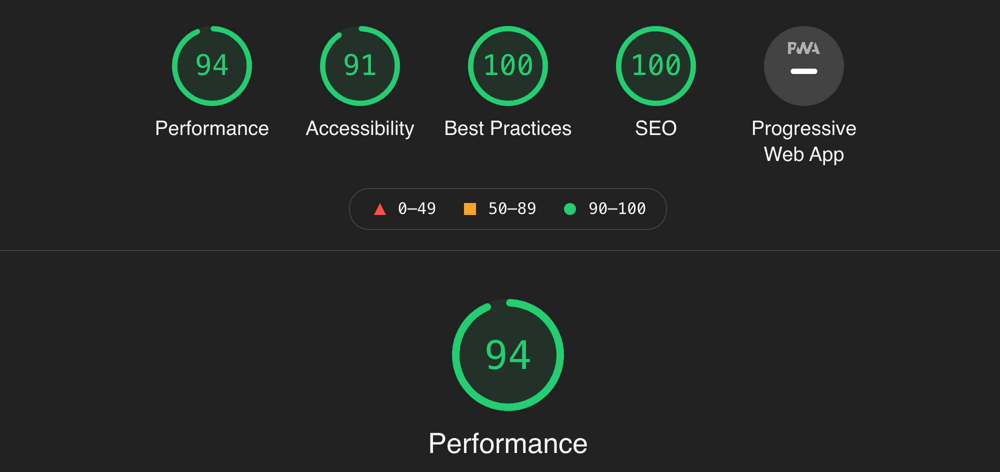

## はじめに
 Gatsbyを用いてこのブログを作ったのは良いものの、数ヶ月の間SEO対策はほったらかしにしていました。最近このブログに色々SEO対策を施したので、その方法を紹介したいと思います。

ちなみにこのブログのstarterは[gatsy-starter-hello-world](https://github.com/gatsbyjs/gatsby-starter-hello-world)です。


## SEOとは
SEOとはSearch Engine Optimizationの略で日本語にすると「検索エンジン最適化」となります。GoogleやYahooなどの検索エンジンで記事が上位に表示されるようにする対策することをいいます。

Gatsbyは静的なHTMLサイトのSEO対策とは違ったアプローチが必要です。それ故に「SPAはSEOに弱い」などと言われていたのですが、GatsbyのSEO系のプラグインは充実していて、それらを使えば簡単に対策することができます。


## Sitemapの生成

Sitemapは検索エンジンのクローラーがサイト構造を読み取るのを助けます。

プラグインに[gatsby-plugin-sitemap](https://www.gatsbyjs.com/plugins/gatsby-plugin-sitemap)が用意されているので、これをインストールします。

<br/>

```bash
$ npm i gatsby-plugin-sitemap
```

gatsby-config.jsにてサイトのURLをなければ追加し、plugins配列に先ほどインストールしたものを追加します。

```js:title=gastby-config.js
siteMetadata: {
  siteUrl: `https://www.example.com`,
},
plugins: [`gatsby-plugin-sitemap`]
```

きちんとSitemapが作成されたかどうかは`https://example.com/sitemap.xml `にアクセスすることで確認できます。
またSitemapはSearch ConsoleでGoogleに提出しましょう。

## headのmetaタグの設定
[React-Helmet](https://github.com/nfl/react-helmet)を用いて行います。Starterによってはもともと入っているものもあると思いますがなければインストールしてください。React-Helmetはhead内のmetaタグを設定するのに使います。

<br/>

このブログの場合は`Head`というmeta情報を管理するコンポーネントを作成してそこで色々設定しています。

今回はこのコンポーネントで
  1. meta設定
  2. Twitterカードの設定
  3. 言語を日本語に設定

を行ます。
<br/>

完成したコードはこちらになります。下でさらに詳しい解説をします。

```js:title=head.js
const Head = ({ title, description, lang, meta }) => {
  const data = useStaticQuery(graphql`
    query {
      site {
        siteMetadata {
          title
          siteUrl
          description
        }
      }
    }
  `)
  return (
    <Helmet
      htmlAttributes={{
        lang,
      }}
      title={`${title} | ${data.site.siteMetadata.title}`}
      meta={[
        {
          name: `description`,
          content: `${data.site.siteMetadata.description}`,
        },
        {
          name: `twitter:card`,
          content: `summary`,
        },
        {
          name: `twitter:creator`,
          content: data.site.siteMetadata.author,
        },
        {
          property: `og:image`,
          content: `${data.site.siteMetadata.siteUrl}/images/tube.png`,
        },
        {
          property: `og:title`,
          content: title,
        },
        {
          property: `og:description`,
          content: `${data.site.siteMetadata.description}`,
        },
        {
          property: `og:type`,
          content: `website`,
        },
        {
          name: `thumbnail`,
          content: `${data.site.siteMetadata.siteUrl}/images/tube.png`,
        },
        {
          name: `twitter:title`,
          content: title,
        },
        {
          name: `twitter:description`,
          content: `${data.site.siteMetadata.description}`,
        },
        {
          property: `og:type`,
          content: `website`,
        },
      ]}
    />
  )
}


```

### サイトの言語の設定

サイトの言語を日本語に設定します。Helmetに`htmlAttribute=lang`を設定して、defaultPropsを`ja`にします。
```js:title=head.js
//..省略
    <Helmet
      htmlAttributes={{
        lang,
      }}

  //..省略

    Head.defaultProps = {
      lang: `ja`,
      meta: [],
      description: ``,
}
```

### Metaの設定
autherやsiteTitleなどの情報は`gatsby-config.js`に入れておいて、そこから取り出せるようにしておきます。

```js:title=gatsby-config.js
module.exports = {
  siteMetadata: {
    title: "k-log",
    author: "Kebeb",
    description: `Kebebの技術ブログ。主にMERN stackの学習の記録`,
    siteUrl: `https://jujekebab.com/`,
  },
```

`head`コンポーネントのgraphQLからアクセスして設定します。

```js:title=gatsby-config.js
        {
          property: `og:description`,
          content: `${data.site.siteMetadata.description}`,
        },
```


### Twitterカードの設定
TwitterなどのSNSで共有した時に、いい感じのカードが表示されるようにします。

```
og:image
twitter:title
twitter:creator
twitter:card
```
さえ設定しておけば最低限の見た目にはなります。


*最低限の見た目の例

画像


作成したカードは[Twitter Card Validator](https://cards-dev.twitter.com/validator)を用いて下見することができます。


## Urlの正規化
Canonical属性を指定します。これもプラグインで簡単に実装できます。
- [gatsby-plugin-canonical-urls](https://www.gatsbyjs.com/plugins/gatsby-plugin-canonical-urls/)


`npm i gatsby-plugin-canonical-urls`して、gatsby-config.jsに追加するだけです。オプションでサイトのURLを追加しましょう。

```javascript{4-6}:title=gatsby-config.js
plugins: [
    {
      resolve: `gatsby-plugin-canonical-urls`,
      options: {
        siteUrl: `https://jujekebab.com`,
        stripQueryString: true,
      },
    },
]
```


## robot.txt の設置
クローラーに読み取ってほしいページと読み取ってほしくないページを伝えます。

こちらも[gatsby-plugin-robots-txt](https://www.gatsbyjs.com/plugins/gatsby-plugin-robots-txt)というプラグインが用意されているので、これを使います。

これもインストールして`gatsby-config.js`に追加するだけです。


## Google Search コンソールでの登録
Google Analyticsを登録しているなら、そこからGoogle search Consoleへリンクすると簡単だと思います。

## LightHouseでも高得点

LighHouseでもSEOは100点でした。あとはコンテンツの質だけだ！




## まとめ

こういう目に見えない細かい作業をすると、はてなブログなどの無料ブログサイトの有り難みがわかります。もしGatsbyを使っていなかったらと思うとどれだけの作業量になるのか…。

構造化データの追加だけはやっていなかったので次回はそれについて紹介したいと思います。


## 参考
[WPからGatsbyへ移行時に気を付けたいSEO対策一覧と導入方法](https://31navi.com/seo-for-gatsby#%E5%BF%85%E8%A6%81%E3%81%AA-seo-%E5%AF%BE%E7%AD%96%E4%B8%80%E8%A6%A7)

[Gatsbyの検索エンジン最適化（SEO）の全まとめ](https://monotein.com/blog/gatsby-seo-and-optimisations?fbclid=IwAR3JgM07ZUjx2Z0cauOQevGrOcUao-FCEU2Lv4ddqqdjE7_Q2elRYNvLems)

[【2021年版】Google サーチコンソール の使い方。ウェブサイト改善のための活用術！](https://www.waca.associates/jp/knowledge/44362/#index_id0)

[Gatsby: SEO対策（最低限やっておくこと）](https://qiita.com/atomyah/items/69028992eacf28d92957#url%E6%AD%A3%E8%A6%8F%E5%8C%96)


<div>Icons made by <a href="https://www.freepik.com" title="Freepik">Freepik</a> from <a href="https://www.flaticon.com/" title="Flaticon">www.flaticon.com</a></div>
